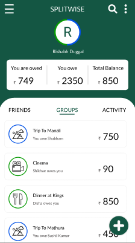
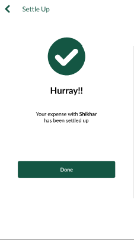

# UPI Split-Bill Feature Mockup

A UI/UX design prototype for a **UPI-based split-bill feature**, inspired by Google Pay and Splitwise. This project demonstrates a seamless flow for splitting bills with friends and settling payments via UPI.

---

## Project Flow
1. **Home Screen:** Overview of groups and pending balances.  
2. **Group Screen:** View group members, shared expenses, and balances.  
3. **Settle Up:** Option to settle outstanding amounts within the group.  
4. **Choose Payment Method:** Select UPI or other available options (mockup).  
5. **Payment Successful:** Confirmation screen after payment is completed.

---

## Features
- Split bills among friends with ease.  
- Track group balances and expenses.  
- Visualize UPI payment flow from start to finish.  
- Clean and intuitive mobile-first design.

---

## Tools
- **Figma** – UI/UX design and prototyping.  
- **Screenshots/Logos** – used apps logos to give a real life touch.

---

## Screenshots of the project
  
  
  
  

---

## Created by
Rishabh Duggal
